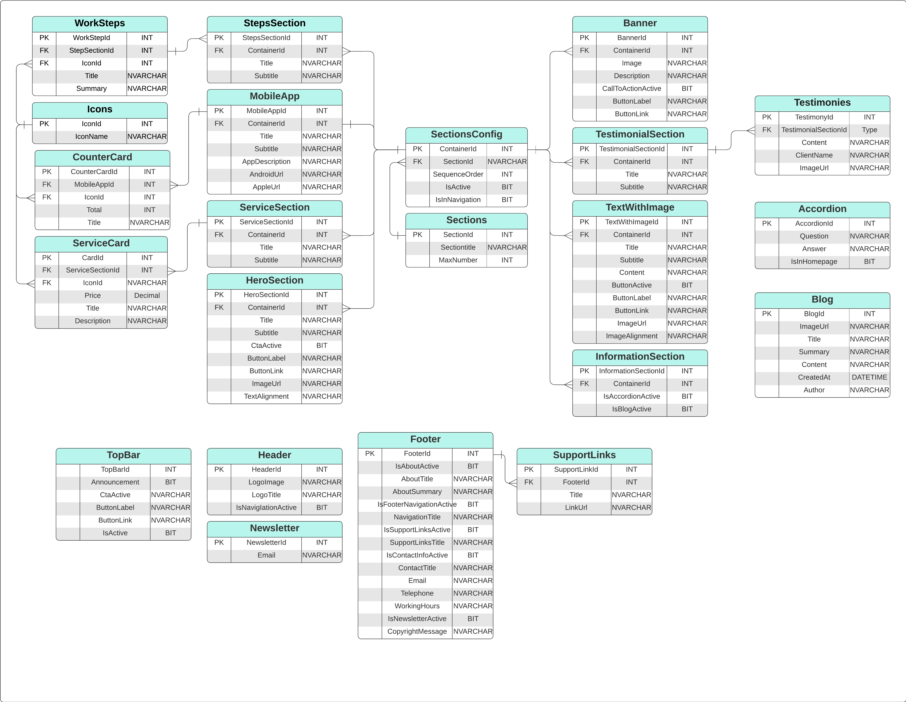

# Autoservices Application Database Parameters Documentation
Documenting the Database structure which is related to the content and layout of Autoservices application
## Entity Relationship Diagram (ERD)

## Table Definitions

### Sections
- **Description:** Table to store section information.
- **Columns:**
  - `SectionId` (int, primary key): Unique identifier for the section.
  - `SectionTitle` (nvarchar(50)): Title of the section.
  - `MaxNumber` (int): Maximum number.

### SectionsConfig
- **Description:** Table to store section configuration information.
- **Columns:**
  - `ContainerId` (int, primary key): Unique identifier for the container.
  - `SectionId` (int): Foreign key referencing the SectionId in the Sections table.
  - `OrderSequence` (int): Order sequence.
  - `IsActive` (bit, default: 0): Indicates if the section is active.
  - `IsInNavigation` (bit, default: 0): Indicates if the section is included in the navigation.

### TopBar
- **Description:** Table to store top bar information with only one row constraint
- **Columns:**
  - `TopBarId` (int, primary key): Unique identifier for the top bar.
  - `Announcement` (nvarchar(100)): Announcement text.
  - `CtaActive` (bit): Indicates if the call-to-action button is active.
  - `ButtonLabel` (nvarchar(50)): Label text for the call-to-action button.
  - `ButtonLink` (nvarchar(100)): URL for the call-to-action button.

### Header
- **Description:** Table to store header information.
- **Columns:**
  - `HeaderId` (int, primary key): Unique identifier for the header.
  - `LogoImage` (nvarchar(100)): Path to the logo image.
  - `LogoTitle` (nvarchar(100)): Title of the logo.
  - `IsNavigationActive` (bit): Indicates if the navigation is active.

### HeroSection
- **Description:** Table to store hero section information.
- **Columns:**
  - `HeroSectionId` (int, primary key): Unique identifier for the hero section.
  - `ContainerId` (int): Foreign key referencing the ContainerId in the SectionsConfig table.
  - `Title` (nvarchar(100)): Title of the hero section.
  - `Subtitle` (nvarchar(200)): Subtitle of the hero section.
  - `CtaActive` (bit): Indicates if the call-to-action button is active.
  - `ButtonLabel` (nvarchar(50)): Label text for the call-to-action button.
  - `ButtonLink` (nvarchar(100)): URL for the call-to-action button.
  - `ImageUrl` (nvarchar(100)): Path to the hero image.
  - `ImageAlignment` (nvarchar(5)): Alignment of the hero image.

### ServiceSection
- **Description:** Table to store service section information.
- **Columns:**
  - `ServiceSectionId` (int, primary key): Unique identifier for the service section.
  - `ContainerId` (int): Foreign key referencing the ContainerId in the SectionsConfig table.
  - `Title` (nvarchar(100)): Title of the service section.
  - `Subtitle` (nvarchar(200)): Subtitle of the service section.
### ServiceCard
- **Description:** Table to store service card information.
- **Columns:**
  - `CardId` (int, primary key): Unique identifier for the service card.
  - `ServiceSectionId` (int): Foreign key referencing the ServiceSectionId in the ServiceSection table.
  - `Icon` (nvarchar(50)): Path to the service card icon.
  - `Price` (decimal(6,2)): Price of the service.
  - `Title` (nvarchar(50)): Title of the service card.
  - `Summary` (nvarchar(150)): Summary of the service card.

### TextWithImage
- **Description:** Table to store text with image section information.
- **Columns:**
  - `TextWithImageId` (int, primary key): Unique identifier for the text with image section.
  - `ContainerId` (int): Foreign key referencing the ContainerId in the SectionsConfig table.
  - `Title` (nvarchar(100)): Title of the text with image section.
  - `Subtitle` (nvarchar(200)): Subtitle of the text with image section.
  - `Content` (nvarchar(600)): Content of the section.
  - `ButtonActive` (bit): Indicates if the button is active.
  - `ButtonLabel` (nvarchar(50)): Label text for the button.
  - `ButtonLink` (nvarchar(100)): URL for the button.
  - `ImageUrl` (nvarchar(100)): Path to the image.
  - `ImageAlignment` (nvarchar(5)): Alignment of the image.

### StepsSection
- **Description:** Table to store steps section information.
- **Columns:**
  - `StepsSectionId` (int, primary key): Unique identifier for the steps section.
  - `ContainerId` (int): Foreign key referencing the ContainerId in the SectionsConfig table.
  - `Title` (nvarchar(100)): Title of the steps section.
  - `Subtitle` (nvarchar(100)): Subtitle of the steps section.

### WorkSteps
- **Description:** Table to store work steps information.
- **Columns:**
  - `WorkStepId` (int, primary key): Unique identifier for the work step.
  - `StepsSectionId` (int): Foreign key referencing the StepsSectionId in the StepsSection table.
  - `IconId` (int): Foreign key referencing the IconId in the Icons table.
  - `Title` (nvarchar(100)): Title of the work step.
  - `Summary` (nvarchar(250)): Summary of the work step.

### Banner
- **Description:** Table to store banner information.
- **Columns:**
  - `BannerId` (int, primary key): Unique identifier for the banner.
  - `ContainerId` (int): Foreign key referencing the ContainerId in the SectionsConfig table.
  - `ImageUrl` (nvarchar(100)): Path to the banner image.
  - `Summary` (nvarchar(100)): Description of the banner.
  - `CallToActionActive` (bit): Indicates if the call-to-action button is active.
  - `ButtonLabel` (nvarchar(50)): Label text for the call-to-action button.
  - `ButtonLink` (nvarchar(100)): URL for the call-to-action button.

### MobileApp
- **Description:** Table to store mobile app information.
- **Columns:**
  - `MobileAppId` (int, primary key): Unique identifier for the mobile app.
  - `ContainerId` (int): Foreign key referencing the ContainerId in the SectionsConfig table.
  - `Title` (nvarchar(100)): Title of the mobile app.
  - `Subtitle` (nvarchar(200)): Subtitle of the mobile app.
  - `AppDescription` (nvarchar(500)): Description of the mobile app.
  - `AndroidUrl` (nvarchar(200)): URL for the Android app.
  - `AppleUrl` (nvarchar(200)): URL for the Apple app.

### CounterCard
- **Description:** Table to store counter card information.
- **Columns:**
  - `CounterCardId` (int, primary key): Unique identifier for the counter card.
  - `MobileAppId` (int): Foreign key referencing the MobileAppId in the MobileApp table.
  - `IconId` (int): Foreign key referencing the IconId in the Icons table.
  - `Total` (int): Total value.
  - `Title` (nvarchar(100)): Title of the counter card.

### TestimonialSection
- **Description:** Table to store testimonial section information.
- **Columns:**
  - `TestimonialSectionId` (int, primary key): Unique identifier for the testimonial section.
  - `ContainerId` (int): Foreign key referencing the ContainerId in the SectionsConfig table.
  - `Title` (nvarchar(100)): Title of the testimonial section.
  - `Subtitle` (nvarchar(100)): Subtitle of the testimonial section.

### Testimonies
- **Description:** Table to store testimonies information.
- **Columns:**
  - `TestimonyId` (int, primary key): Unique identifier for the testimony.
  - `TestimonialSectionId` (int): Foreign key referencing the TestimonialSectionId in the TestimonialSection table.
  - `Content` (nvarchar(300)): Content of the testimony.
  - `ClientName` (nvarchar(100)): Name of the client.
  - `ImageUrl` (nvarchar(100)): URL of the image.

### InformationSection
- **Description:** Table to store information section information.
- **Columns:**
  - `InformationSectionId` (int, primary key): Unique identifier for the information section.
  - `ContainerId` (int): Foreign key referencing the ContainerId in the SectionsConfig table.
  - `IsAccordionActive` (bit): Indicates if the accordion is active.
  - `IsBlogActive` (bit): Indicates if the blog is active.

### Accordion
- **Description:** Table to store accordion information.
- **Columns:**
  - `AccordionId` (int, primary key): Unique identifier for the accordion.
  - `InformationSectionId` (int): Foreign key referencing the InformationSectionId in the InformationSection table.
  - `Question` (nvarchar(200)): Question of the accordion.
  - `Answer` (nvarchar(400)): Answer of the accordion.

### Blog
- **Description:** Table to store blog information.
- **Columns:**
  - `BlogId` (int, primary key): Unique identifier for the blog.
  - `InformationSectionId` (int): Foreign key referencing the InformationSectionId in the InformationSection table.
  - `ImageUrl` (nvarchar(100)): URL of the image.
  - `Title` (nvarchar(100)): Title of the blog.
  - `Summary` (nvarchar(250)): Summary of the blog.
  - `Content` (nvarchar(max)): Content of the blog.
  - `CreatedAt` (datetime): Date and time of creation.
  - `Author` (nvarchar(100)): Author of the blog.

### Footer
- **Description:** Table to store footer information.
- **Columns:**
  - `FooterId` (int, primary key): Unique identifier for the footer.
  - `IsAboutActive` (bit): Indicates if the about section is active.
  - `AboutTitle` (nvarchar(100)): Title of the about section.
  - `AboutSummary` (nvarchar(300)): Summary of the about section.
  - `IsFooterNavigationActive` (bit): Indicates if the footer navigation is active.
  - `NavigationTitle` (nvarchar(50)): Title of the footer navigation.
  - `IsSupportLinksActive` (bit): Indicates if the support links section is active.
  - `SupportLinksTitle` (nvarchar(50)): Title of the support links section.
  - `IsContactInfoActive` (bit): Indicates if the contact information section is active.
  - `ContactTitle` (nvarchar(100)): Title of the contact information section.
  - `Email` (nvarchar(100)): Email address.
  - `Telephone` (nvarchar(15)): Telephone number.
  - `WorkingHours` (nvarchar(50)): Working hours.
  - `IsNewsletterActive` (bit): Indicates if the newsletter section is active.
  - `CopyrightMessage` (nvarchar(150)): Copyright message.

### SupportLinks
- **Description:** Table to store support links information.
- **Columns:**
  - `SupportLinkId` (int, primary key): Unique identifier for the support link.
  - `FooterId` (int): Foreign key referencing the FooterId in the Footer table.
  - `Title` (nvarchar(50)): Title of the support link.
  - `LinkUrl` (nvarchar(100)): URL of the support link.

### Icons
- **Description:** Table to store icon information.
- **Columns:**
  - `IconId` (int, primary key): Unique identifier for the icon.
  - `IconName` (nvarchar(100)): Name of the icon.

### ErrorLog
- **Description:** Table to store error log information.
- **Columns:**
  - `ErrorLogId` (int, primary key): Unique identifier for the error log.
  - `ErrorMessage` (nvarchar(max)): Error message.
  - `ErrorNumber` (int): Error number.
  - `ProcedureName` (nvarchar(255)): Name of the procedure.
  - `LogTimestamp` (datetime): Timestamp of the error log.

## SQL Scripts
SQL Database Structure can be found [here](./DBStructure.sql)

## Constraints
SQL Constraints can be found [here](./Constraints.sql)

## Views, Stored Procedures, and Functions
SQL Stored Procedures for each table can be found [here](./StoredProcedures/README.md)

## Custom Code Errors
Each Error throwen from the SQL Server is documented [here](./CustomCodeErrors.md)

